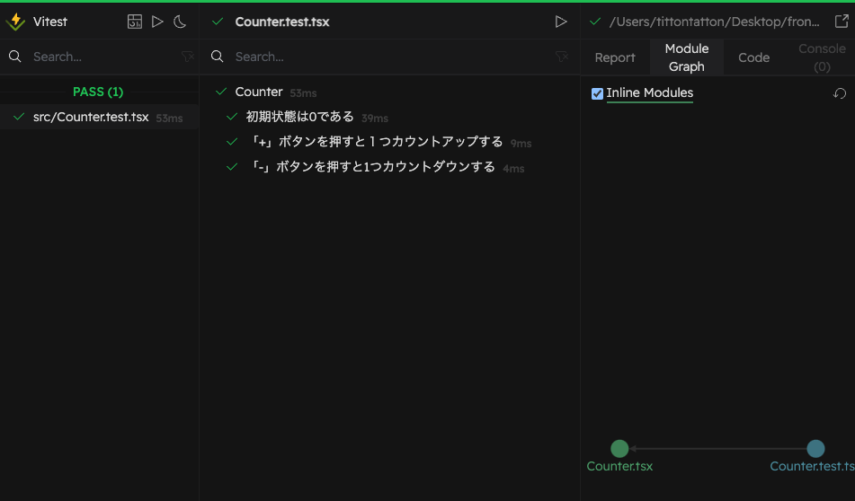

# README

## About

この記事のサンプルを Vite 中心の構成でやってみる。  
[フロントエンドで TDD を実践する（react-testing-library を使った実践編） - Qiita](https://qiita.com/taneba/items/b21f5fee17eb593b30c8)

## How to Use

### Setup

```bash
npm install
```

### Testing

コマンドラインで実行


UI モードで実行


VS Code から実行


### Coverage

```bash
npm run coverage
```


## Tools

- [Vite](https://ja.vitejs.dev/)
- [Vitest](https://vitest.dev/)
- [Rome](https://rome.tools/)
- [Mantine](https://mantine.dev/)
- [Testing Library](https://testing-library.com/)

## Note

- Vitest + Testing Library は柔軟にテストをかけて実行も早いので使い勝手がいい。
- Vitest のモックに関する記事があまりない。とはいえ、公式のドキュメントをちゃんと読めばいいか。([Mocking - Vitest Docs](https://vitest.dev/guide/mocking.html))
- TDD で書いて最後にスタイルをつけるのはちょっとつらい。ロジックを持たない見た目部分だけ Storybook 環境で仕上げて、TDD でコンポーネントを完成させるような手順にしてみる予定。
